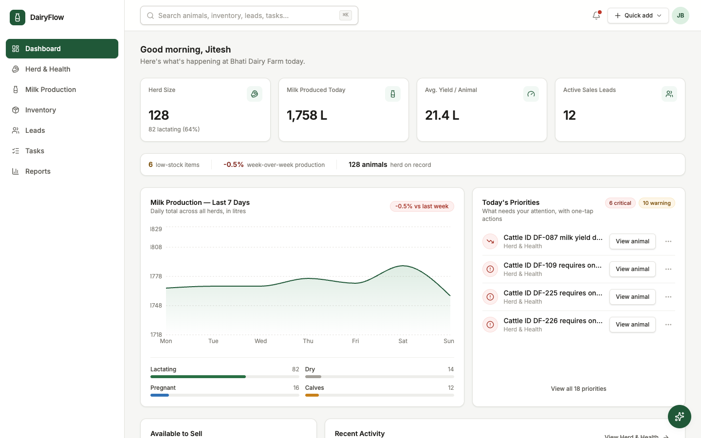
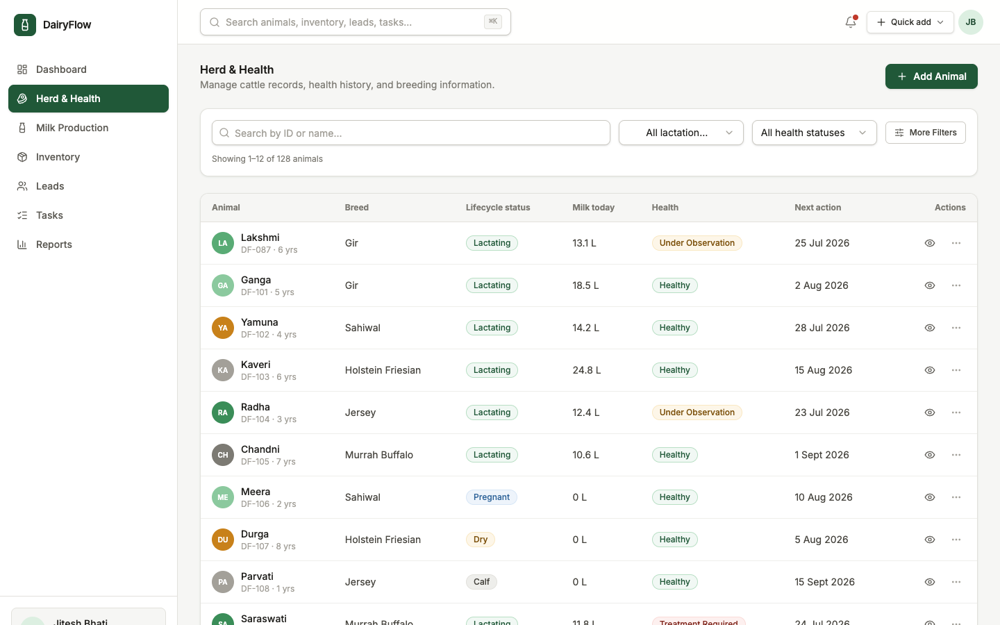
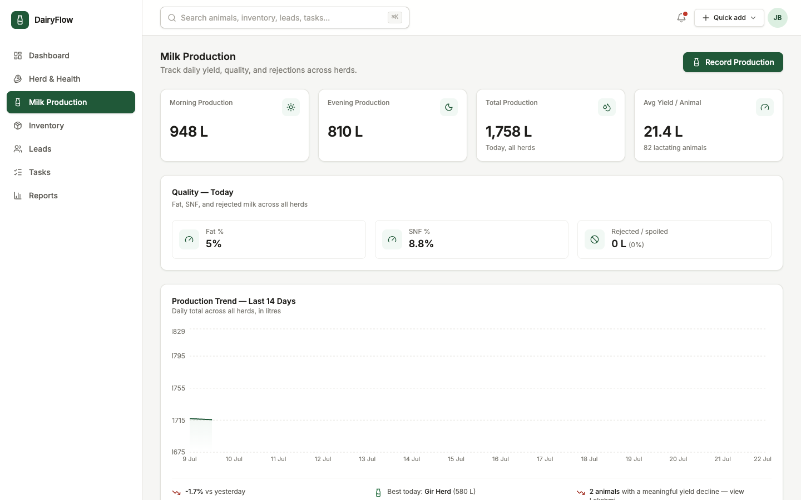
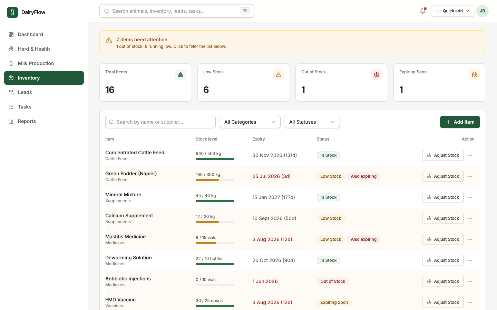
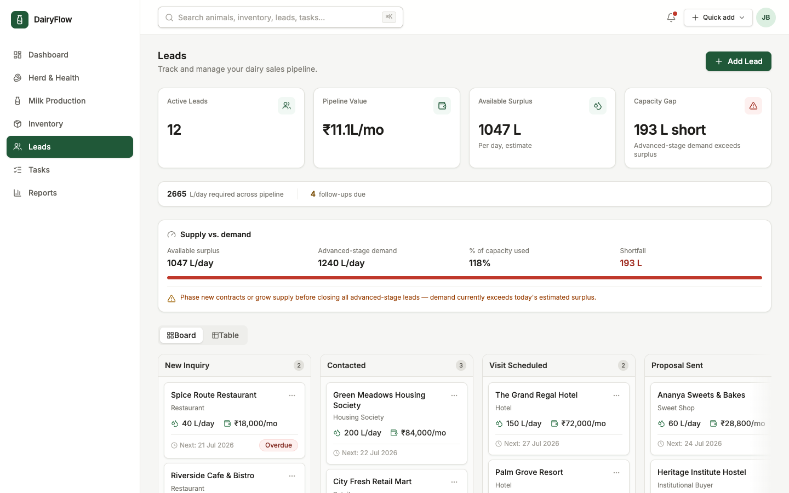
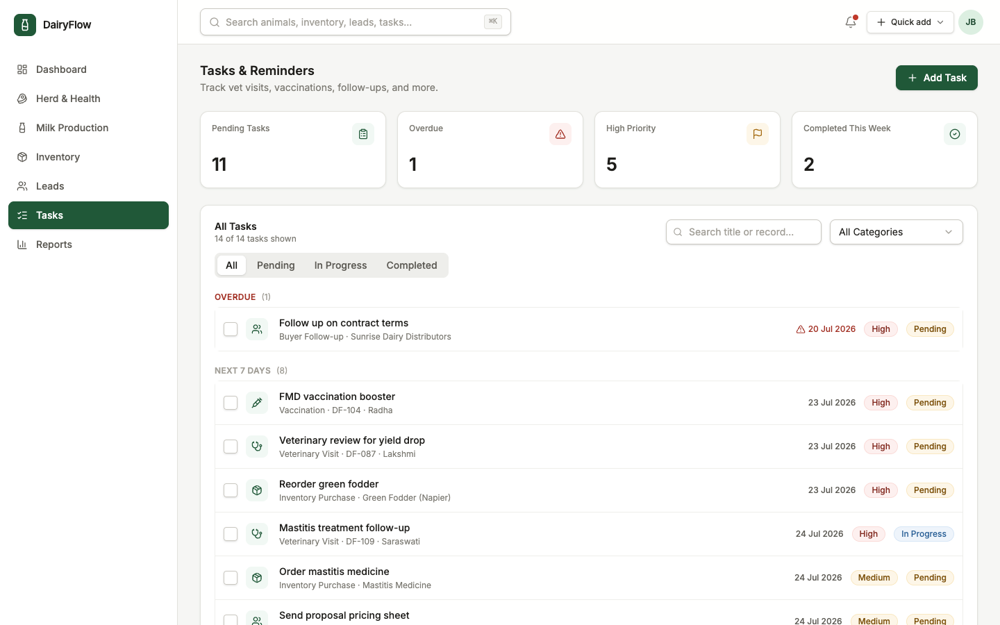
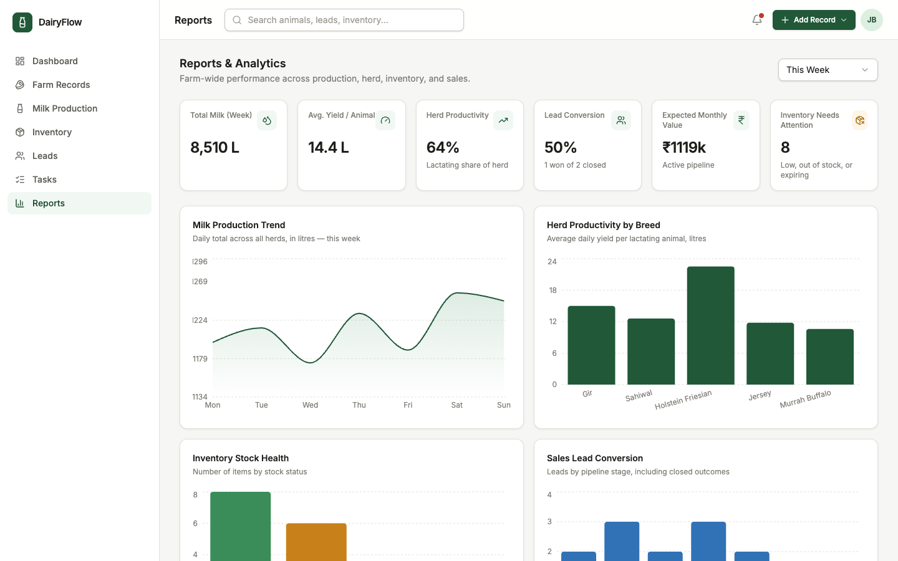

# DairyFlow

A frontend-only prototype of a business management platform for dairy farms — built for **Bhati Dairy Farm** (Jodhpur, Rajasthan). React, TypeScript, Vite, Tailwind CSS, Radix-based UI components, and Recharts. No backend: all data lives in a single shared React Context + reducer, persisted to `localStorage`. See `PRODUCT_NOTES.md` for the full product rationale and `DEMO_SCRIPT.md` for a guided walkthrough.

## Getting started

```bash
npm install
npm run dev
```

Then open the printed local URL (e.g. http://localhost:5173).

```bash
npm run build     # type-check + production build
npm run lint      # oxlint over src/
npm run preview   # preview the production build locally
```

## Architecture

All domain data (animals, milk production entries, inventory items + transactions, leads, tasks, activity log) lives in one shared store: `src/store/AppDataContext.tsx` (Context + reducer, persisted to a versioned `localStorage` key) and `src/store/selectors.ts` (pure derived calculations — KPIs, alerts, herd summary, available-to-sell capacity, lead conversion, inventory consumption). Every page reads from this single source, so the same metric never disagrees with itself across screens, and every reducer action is undoable in spirit via the header's **Reset Demo Data** action.

Historical data (90 days of milk production, ~30–40 inventory transactions) is generated deterministically (`src/data/milkProduction.ts`, `src/data/inventory.ts`) — same numbers every time the demo resets, fully explainable, no `Math.random()`.

## Screens & features

### Dashboard


- Four primary KPI tiles (milk today, average yield, herd health, stock alerts) — plain text values, no colored icon tiles competing for attention.
- **Priorities** — a compact, divider-separated list showing the 3 highest-priority alerts with one primary action per row; "View all" expands the rest in place.
- Two-column operational layout: 7-day milk production trend on the left, Priorities on the right, so the trend is never buried below the fold.
- **Available to Sell** — an estimate of surplus milk for new buyers (today's production, minus a processing reserve, minus litres already committed to signed buyers), with a capacity-gap warning.
- Recent-activity timeline logged automatically by every write action across the app.
- **Farm Assistant** — a compact, icon-led floating launcher opening a slide-over chat with text and voice (mic) input. Answers deterministically from the shared store (not a hosted LLM, by design) and includes clickable suggested-question chips and in-chat links to the relevant page.

### Herd & Health


- A scannable table (Animal with avatar/name/ID+age, Breed, Stage, Yield, Health, Next due) — the entire row is clickable and its own overflow menu holds edit/quick-action shortcuts, so no separate View button is needed. "Healthy" renders as plain muted text; badges are reserved for Under Observation / Treatment Required.
- Simplified filters: search, one Health dropdown inline, a **More Filters** popover for breed/stage/sort, active filter chips, and Clear all — select labels are never truncated.
- Animal details now open in a **right-side drawer** (not a small centered dialog) with quick actions — **Log health event**, **Record vaccination**, **Add breeding event**, **Record milk yield**, **Create veterinary task** — a health timeline, vaccination/breeding/yield tabs, and any open tasks linked to that animal, completable in place.

### Milk Production


- One compact summary line — **Milk today** with the week-over-week change, then Morning/Evening/Average inline, then Fat %/SNF %/Rejected inline — instead of six KPI cards. Zero rejected milk reads as plain neutral text, not a false alarm.
- 14-day production trend chart with insights (change vs. yesterday, best-performing herd, animals with a meaningful yield decline — clickable through to their record, with correct singular/plural grammar).
- **Record Production** dialog with auto-computed quality status.

### Inventory


- One quiet summary line (total items · low stock · out of stock · expiring soon) replaces the old KPI-card row and warning banner; a **Show attention only** toggle filters the table to at-risk items.
- Each row shows a stock-level progress bar (current vs. minimum) and an expiry countdown; "In stock" renders as plain text, while Low Stock / Out of Stock / Expiring Soon get badges — an item that's both low-stock *and* expiring shows both signals. At-risk rows get a light amber tint.
- The whole row opens the details view; **Adjust Stock** appears as a contextual action on hover, with Create restock task in the row's overflow menu.
- **Adjust Stock** — a transaction-based workflow (Stock In / Consumed / Wastage / Expired / Correction) with date, supplier, and notes, replacing ambiguous balance-editing. Every transaction is stored and feeds the Reports consumption chart.

### Leads (CRM)


- One compact summary line (active leads · pipeline value · follow-ups due · required L/day) and one supply-vs-demand line (available supply · advanced-stage demand · shortfall or "within capacity") replace the old six-card KPI row and banner — the Kanban board starts right below.
- Dairy-specific fields: required litres/day, product type, price/litre, delivery location/distance/timing, trial order status — alongside the standard stage, source, and follow-up fields (surfaced in the lead drawer, not the card).
- Kanban pipeline across 7 stages, minimum 280px columns, sticky stage headers, a right-edge fade cue signaling more columns are scrollable, and intentional empty states per stage. Cards lead with business name, buyer type, required L/day, estimated monthly value, and next follow-up (replaced by a plain-text **Overdue** flag when due). Drag-and-drop **and** a reliable "Move to..." menu; quick actions for Mark contacted, Reschedule follow-up, Mark trial complete, Mark Won/Lost.
- Table view toggle for a denser, sortable alternative to the board.

### Tasks


- Compact tabs with live counts (Overdue / Today / Upcoming / Completed) filter the grouped, divider-separated list — no KPI cards. Completed tasks render muted with strike-through; only High-priority, not-yet-completed tasks get a priority badge.
- Filterable by category and free-text search; overdue items flagged in red; one-click complete/reopen toggle via a larger checkbox tap target.

### Reports


- One high-level insight sentence up top ("Milk production increased X% this period, while N inventory items need attention"), three primary KPI tiles (milk, average yield, lead conversion — no icon tiles), and compact color-coded insight cards below (positive trend, risk, operational observation, recommended action) — relevant ones deep-link to the related page. No closed leads in the period reads **"No closed leads"**, never a misleading 0%.
- A working **period selector** (Last 7 / 30 / 90 Days) that re-aggregates every chart and KPI on the page from the same shared selectors used elsewhere.
- Two primary charts above the fold — milk production trend and herd productivity by breed (horizontal bars so long breed names never wrap or truncate) — with inventory and sales reports moved into an **Inventory / Sales** tabbed section below, given secondary visual weight.

### Global search
Press the search bar (or `⌘K` / `Ctrl K`) anywhere in the app for a command-style dialog searching animals, inventory items, leads, and tasks by name — selecting a result navigates to and opens that record. On desktop the header shows the search bar in place of a repeated page title (the current page name only appears in the mobile header); the header's quick-add control is a compact secondary dropdown so it never competes visually with each page's primary Add button.

## Design decisions

- Deep green as the primary brand accent on white/neutral surfaces; amber and red are reserved for genuine warning states, and badges are reserved for meaningful exceptions rather than every ordinary category (e.g. "Healthy" and "In Stock" render as plain muted text).
- A small shared UI kit (button, card, badge, dialog, select, tabs, dropdown, toast, etc.) is used consistently across every screen, with each module's layout tailored to its primary workflow rather than a repeated "KPI row + table" template everywhere.
- Three levels of elevation: neutral page background, white panels with a subtle border (no shadow — shadows are reserved for dialogs, dropdowns, and floating overlays), and divider-separated internal rows instead of cards-inside-cards.
- Each screen surfaces at most 3–4 primary metrics as plain-text KPI tiles (no colored icon badge per label); everything else lives in a one-line compact summary, a details drawer, or an overflow menu, per a "what does the user need to decide next" standard rather than "what could we show."
- Every record exposes at most one primary action inline (the row/card itself is clickable); secondary actions live in a three-dot overflow menu.
- Content is capped at a max width and consistent horizontal padding (16px mobile / 20–24px tablet / 24–32px desktop) so the layout never stretches awkwardly on very wide screens.
- The header's Quick add menu deep-links into each page's own add dialog (`?new=1`); search results and priority/insight actions deep-link into detail views (`?open=<id>`).

## Cross-module scenarios (manually verified)

1. **Inventory**: open a low-stock item → record a Stock In transaction → status, dashboard low-stock KPI, and the related alert all update → refresh retains the change.
2. **Lead**: add a lead with litres/day and price → move its stage → reschedule its follow-up → dashboard active-lead/follow-up metrics and capacity calculations update → refresh retains the change.
3. **Animal health**: open an animal with a vaccination due → record the vaccination → next check-up updates and the dashboard alert clears → refresh retains the change.
4. **Milk production**: add a production record → daily totals, average yield, dashboard, and reports all update to the same number → refresh retains the record.

## Known scope cuts

- The Farm Assistant answers from the app's local, deterministic shared state with keyword matching — it is not connected to a hosted LLM (this is a frontend-only, no-backend prototype), and its own copy says so.
- "Available to Sell" and "Demand vs Capacity" are clearly labeled estimates based on a simple stated assumption (a flat 12% processing/household reserve), not a real forecasting model.
- Reports' herd-productivity and lead-conversion figures use real counts/dates from the shared store, but individual animal yield records and herd-level milk log entries remain two independently-authored datasets — they are internally consistent, not perfectly reconciled animal-by-animal.
